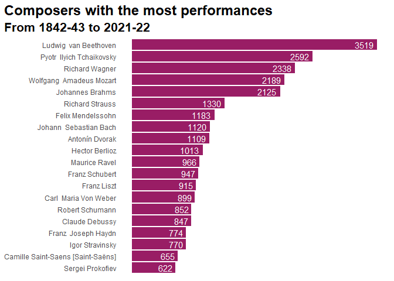

<!-- README.md is generated from README.Rmd. Please edit that file -->

# nyphil 

<!-- badges: start -->
<!-- badges: end -->

An R data package with performance history data from the [New York
Philharmonic](https://archives.nyphil.org/index.php/open-data).

## Installation

You can install the development version of nyphil from
[GitHub](https://github.com/) with:

``` r
# install.packages("remotes")
remotes::install_github("drbtlr/nyphil")
```

## About the data

The `nyphil` package contains performance history data from all known
concerts of the [New York Philharmonic](https://nyphil.org/). Data were
collected and made available by the [New York Philharmonic
Archives](https://archives.nyphil.org/index.php/open-data).

There are two datasets included in the package. The dataset `nyphil` is
a lightly-cleaned, tidy version of the raw data; see `?nyphil` for more
info.

``` r
library(nyphil)

dplyr::glimpse(nyphil)
#> Rows: 154,988
#> Columns: 16
#> $ id                 <chr> "00646b9f-fec7-4ffb-9fb1-faae410bd9dc-0.1", "00646b~
#> $ program_id         <chr> "3853", "3853", "3853", "3853", "3853", "3853", "38~
#> $ orchestra          <chr> "New York Philharmonic", "New York Philharmonic", "~
#> $ season             <chr> "1842-43", "1842-43", "1842-43", "1842-43", "1842-4~
#> $ event_type         <chr> "Subscription Season", "Subscription Season", "Subs~
#> $ location           <chr> "Manhattan, NY", "Manhattan, NY", "Manhattan, NY", ~
#> $ venue              <chr> "Apollo Rooms", "Apollo Rooms", "Apollo Rooms", "Ap~
#> $ date               <chr> "1842-12-07T05:00:00Z", "1842-12-07T05:00:00Z", "18~
#> $ time               <chr> "8:00PM", "8:00PM", "8:00PM", "8:00PM", "8:00PM", "~
#> $ id_2               <chr> "52446*", "8834*4", "3642*", "3642*", "3642*", "364~
#> $ composer_name      <chr> "Beethoven,  Ludwig  van", "Weber,  Carl  Maria Von~
#> $ work_title         <chr> "SYMPHONY NO. 5 IN C MINOR, OP.67", "OBERON", "QUIN~
#> $ conductor_name     <chr> "Hill, Ureli Corelli", "Timm, Henry C.", NA, NA, NA~
#> $ soloist_name       <chr> NA, "Otto, Antoinette", "Scharfenberg, William", "H~
#> $ soloist_instrument <chr> NA, "Soprano", "Piano", "Violin", "Viola", "Cello",~
#> $ soloist_roles      <chr> NA, "S", "A", "A", "A", "A", "A", NA, "S", "S", "S"~
```

The dataset `nyphil_raw` contains all the variables and original names
as downloaded; see `?nyphil_raw` for more info.

## Example

Users are encouraged to use these datasets for exploration, learning,
and fun.

    #> Selecting by n


